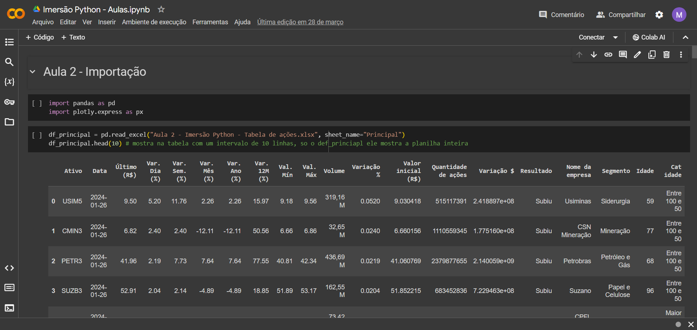
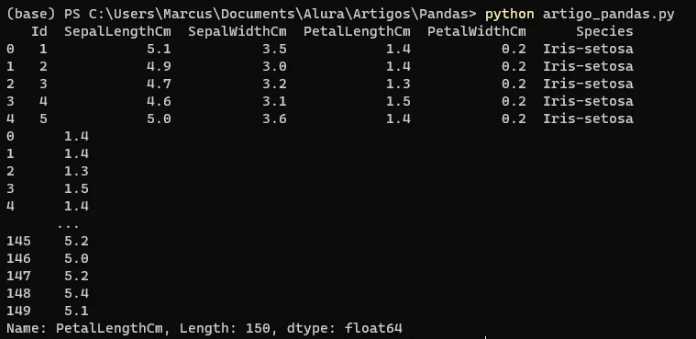

# Objetivos da aula

- Gerar de tabelas e cálculos de estatísticas;
- Criar gráficos no Google Sheets;
- Conhecer o Google Colab;
- Iniciar a manipulação de dados com Python Pandas.

[Introdução ao Google colab](https://colab.research.google.com/drive/1342Sr4_xIiwTjlbllAycEQ1OClNQkIiM?authuser=1#scrollTo=-Rh3-Vt9Nev9)

---
# Planilha de análise

Nesta aula foram feitas análises sobre a planilha da aula anterior (Aula 1)

Com relação a analise dos valores análise básica dos valores, foram feitas:
**Análise descritiva**
- media dos valores de variação
- maior valor de variação que ocorreu naquele dia
- menor valor de variação que ocorreu naquele dia

Para se ter um cálculo mais correto, foram feitas:
- Media das variações que subiram 
- Média das variações que desceram

| Cálculo              | Valor                | Empresa  |
| -------------------- | -------------------- | -------- |
| Maior                | R$ 4.762.926.995,25  | Vale     |
| Menor                | -R$ 1.807.432.634,46 | Localiza |
| Média                | R$ 165.190.210,48    |          |
| Média de quem subiu  | R$ 448.164.250,23    |          |
| Média de quem desceu | -R$ 181.109.141,75   |          |

**Análise qualitativa**
Para isso foi feita uma análise por segmento:
- inicialmente foi feita uma tabela com os segmentos usando a formula *unique*
- Após isso foi contado a variação de cada segmento (*SUMIF*)
- Por último foi colocado somente os valores de variação que subiram (*SUMIFS*)

| Segmento             | Variação             | Variação de quem subiu |
| -------------------- | -------------------- | ---------------------- |
| Siderurgia           | R$ 489.935.930,93    | R$ 489.935.930,93      |
| Mineração            | R$ 4.940.442.965,55  | R$ 4.940.442.965,55    |
| Petróleo e Gás       | R$ 5.243.195.684,74  | R$ 5.243.195.684,74    |
| Papel e Celulose     | R$ 722.946.282,71    | R$ 722.946.282,71      |
| Energia              | -R$ 39.191.035,28    | R$ 839.184.846,22      |
| Petróleo             | R$ 850.093.147,52    | R$ 850.093.147,52      |
| Shopping Centers     | R$ 117.732.680,08    | R$ 117.732.680,08      |
| Banco                | R$ 3.740.512.018,78  | R$ 3.740.512.018,78    |
| Saúde                | R$ 60.321.469,88     | R$ 453.917.907,01      |
| Química              | R$ 69.054.317,64     | R$ 69.054.317,64       |
| Transporte Aéreo     | -R$ 37.540.997,06    | R$ 65.452.205,55       |
| Educação             | R$ 54.641.872,47     | R$ 72.295.838,99       |
| Indústria            | R$ 270.474.813,52    | R$ 388.705.223,96      |
| Construção Civil     | -R$ 61.087.401,61    | R$ 37.525.872,38       |
| Calçados             | R$ 19.895.417,77     | R$ 41.021.792,09       |
| Alimentos            | R$ 407.833.683,09    | R$ 407.833.683,09      |
| Varejo               | -R$ 600.878.797,53   | R$ 237.187.009,24      |
| Telecomunicações     | R$ 292.938.114,42    | R$ 292.938.114,42      |
| Logística            | R$ 233.902.674,79    | R$ 233.902.674,79      |
| Serviços Financeiros | -R$ 1.130.127.982,99 | R$ 43.657.683,38       |
| Holding              | R$ 416.092.244,42    | R$ 416.092.244,42      |
| Tecnologia           | R$ 6.067.508,90      | R$ 15.598.886,65       |
| Bebidas              | R$ 0,00              | R$ 0,00                |
| Seguros              | -R$ 26.297.880,21    | R$ 0,00                |
| Saneamento           | -R$ 15.725.678,56    | R$ 0,00                |
| Agronegócio          | -R$ 88.901.449,42    | R$ 0,00                |
| Infraestrutura       | -R$ 39.743.554,31    | R$ 0,00                |
| Aviação              | -R$ 233.651.943,50   | R$ 0,00                |
| Cosméticos           | -R$ 193.280.001,21   | R$ 0,00                |
| Farmacêutica         | -R$ 208.257.014,20   | R$ 0,00                |
| Aluguel de Carros    | -R$ 1.807.432.634,46 | R$ 0,00                |
| Turismo              | -R$ 73.557.408,06    | R$ 0,00                |

Foi feita também uma tabela dos valores de variação pelo resultado (subiu, desceu ou estável)
- a primeira coluna foi feita usando o *unique*
- e a segunda coluna das somas das variações (*SUMIF*)

| Resultado | Variação $         |
|-----------|--------------------|
| Subiu     | R$ 19.719.227.010,14 |
| Estável   | R$ 0,00            |
| Desceu    | -R$ 6.338.819.961,32 |
|           | R$ 13.380.407.048,83 |

E a ultima tabela feita foi das somas das variações com base na idade das empresas
- A coluna das idades (*UNIQUE*)
- Coluna das variações (*SUMIF*)
- Coluna da quantidade de empresas que possuem aquela idade (*COUNTIF*)

| Análise por Faixa Etária | Variação             | Quantidade de empresas |
| ------------------------ | -------------------- | ---------------------- |
| Entre 100 e 50           | R$ 11.409.596.443,58 | 32                     |
| Maior que 100            | -R$ 250.815.638,02   | 8                      |
| Menor que 50             | R$ 2.221.626.243,26  | 41                     |
## Gráficos

Para a criação de gráficos no Google Sheets é necessário selecionar as colunas que serão utilizadas com control, e clicar na opção inserir > gráfico. Após isso ele já da uma sugestão de gráfico mas você pode mudar e fazer outras configurar no menu que aparece na lateral direita.

>**outliers** - pontos fora da curva, empresas que possuem um valor muito alto. Pode tirar os valores para facilitar a análise

# Python

Está segunda aula foi somente uma introdução aos códigos em python. Foram feitas somente as importações das páginas da planilha para diferentes DataFrames

Foi usado o Google Colab para executar os códigos.

>colab.new é um atalho para criar um novo notebook no Google Colab
Está plataforma não salva os arquivos, necessitando que os mesmos sejam inseridos cada vez que se entra no Google Colab

**Biblioteca pandas**: Utilizada para análise de dados em python

[Arquivo com os códigos utilizados](Aula2_codigo.ipynb)

---
# Conteúdo extra I.A.

Nessa aula de conteúdo extra foi mostrado uma extensão para o google sheets que faz o uso do ChatGPT
sheetgpt

[link para a extensão](https://workspace.google.com/marketplace/app/sheetgpt_ai_and_chatgpt_for_sheets/1071108744264)

---
# Desafio proposto

- Crie um gráfico de barras olhando a faixa etária e o valor da variação;
- Faça outro gráfico de barras com a faixa etária e a quantidade de empresas que estão em cada faixa etária;
- Explore os tipos de gráficos com os dados já feitos.

[Planilha com o desafio completo](https://docs.google.com/spreadsheets/d/1Vjh6yFUH7W1JIaQtgncKu5DO9wc0db3nFUE4L7IQ-no/edit#gid=1149033606)

---
# Links para saber mais

## Pandas Python: O que é, para que serve

### O que é pandas?

O pandas é uma biblioteca da linguagem python, usada para a ciência de dados.

O Pandas pode ser usado para várias atividades e processos, como: 
- Limpeza e tratamento de dados
- Análise exploratória de dados
- Suporte em atividades de Machine Learning
- Consultas e queries em bancos de dados relacionais
- Visualização de dados
- Webscraping

Além disso, também possui integração com outras bibliotecas muito utilizadas em Ciência de Dados, como: Numpy, Scikit-Learn, Seaborn, Altair, Matplotlib, Plotly, Scipy.s

### Como funciona o pandas?

Dentro do pandas existem as Series e os DataFrames.

Ambas as estruturas mostradas a seguir podem ser feitas com a leitura e escrita de arquivos como CSV, Excel, SQL, HTML, JSON, XML, Parquet, entre outros.

#### Series

As Series são objetos de tipo array unidimensional, possuindo um eixo de rótulos (index) que identifica cada registro.
Ex:

| 0   | 1.4   |
| -- | ----- |
| 1   | 1.4   |
| 2   | 1.3   |
| 3   | 1.5   |
| 4   | 1.4   |
|     | . . . |
| 145 | 5.2   |
| 146 | 5.0   |
| 147 | 5.2   |
| 148 | 5.4   |
| 149 | 5.1   |
`Name: PetalLengthCm, Length: 150, dtype: float64`

A primeira coluna é o **index** e a segunda coluna são os **dados**. Além disso no final também é apresentado uma pequena descrição de nome, formato e tipo de dados que estão presentes nesta **Serie**
#### DataFrames

Os DataFrames são objetos bidimendionais, possuem um formato de tabela, organizados por linhas e colunas.

|     | Id  | SepalLengthCm | SepalWidthCm | PetalLengthCm | PetalWidthCm | Species        |
| --- | --- | ------------- | ------------ | ------------- | ------------ | -------------- |
| 0   | 1   | 5.1           | 3.5          | 1.4           | 0.2          | Iris-setosa    |
| 1   | 2   | 4.9           | 3.0          | 1.4           | 0.2          | Iris-setosa    |
| 2   | 3   | 4.7           | 3.2          | 1.3           | 0.2          | Iris-setosa    |
| 3   | 4   | 4.6           | 3.1          | 1.5           | 0.2          | Iris-setosa    |
| 4   | 5   | 5.0           | 3.6          | 1.4           | 0.2          | Iris-setosa    |
|     | ... | ...           | ...          | ...           | ...          | ...            |
| 145 | 146 | 6.7           | 3.0          | 5.2           | 2.3          | Iris-virginica |
| 146 | 147 | 6.3           | 2.5          | 1.9           | 1.9          | Iris-virginica |
| 147 | 148 | 6.5           | 3.0          | 2.0           | 2.0          | Iris-virginica |
| 148 | 149 | 6.2           | 3.4          | 2.3           | 2.3          | Iris-virginica |
| 149 | 150 | 5.9           | 3.0          | 1.8           | 1.8          | Iris-virginica |

### Pandas e o Excel

Como o pacote Office da Microsoft é bem aceito no mercado, surgem muitas perguntas do porque usar o pandas se existe a possibilitade de fazer isso com o Excel.

A resposta para essa questão é bem simples, já que o Excel possui um limite de 1.048.576 linhas e 16.384 colunas. E no pandas esse limite varia de acordo com a memória disponível.

Isso é muito importante saber quando se é necessário trabalhar com Big Data, que nada mais é que uma grande quantidade de dados.

Mas ambos os softwares podem ser usados juntos, já que o pandas possui uma compatibilidade com arquivos excel.

### Como o pandas é utilizado?

O pandas é bastante utilizado com notebooks interativos python (.ipynb), como o Jupyter notebook, no qual o Google Colab é baseado.
Com esses notebooks se pode ter uma melhor visualizaçõa do código e suas saídas, possuindo também modos interativos.
Ex:

Mas também é possível se trabalhar com arquivos python comuns (.py), a grande diferença é que os resultados de saída serão exibidos no terminal.
Ex:

### Instalação do pandas

Para se instalar a biblioteca pandas pode-se utilizar o código `pip install pandas` no seu terminal

[Pandas Python: o que é, para que serve](https://www.alura.com.br/artigos/pandas-o-que-e-para-que-serve-como-instalar?_gl=1*zrqqjk*_ga*MTE5MTY2MTIxOC4xNzA4ODAxNDkz*_ga_1EPWSW3PCS*MTcxMTczNDgxNC4yOC4xLjE3MTE3MzU3NjEuMC4wLjA.*_fplc*OVZRZFJqVVdhbEdKa0c2dGFrQVRSRlNvN3hlclF6d0M0MkxHTTF6RVJBWDFtZk1LZkpvY094JTJGN3ZURU1jOGpZcU1DcCUyRmdMa1A2NDlxendUR0k5YVJ3ajBnOWFUWmxtN2VLUiUyQmZJJTJCS3ZQSGJnazFDaGZJZlVPR3A1S3RBOWclM0QlM0Q.)
